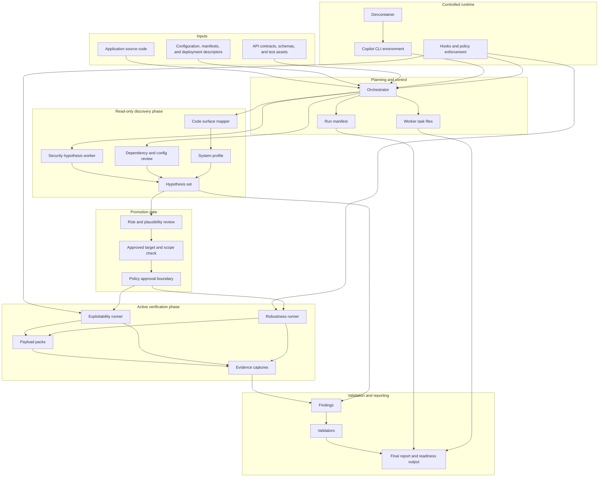

# Security-First White-Box Testing Toolchain

This repository is a beginner-friendly scaffold for a security-first, white-box, code-first testing toolchain.

In plain English, it is trying to help you do this:

1. read an application's source code and configuration first
2. decide what looks risky
3. turn those risks into focused tests
4. capture evidence from those tests
5. validate the results before treating them as real findings

It is built around GitHub Copilot CLI concepts such as custom agents, skills, hooks, and deterministic run artifacts. Right now it is an MVP scaffold, not a fully autonomous product. That means the repository already defines the structure, files, prompts, and helper scripts, but some stages still prepare placeholder artifacts instead of driving a full live campaign on their own.

## Who This Is For

This repo is for people who want to understand or extend an AI-assisted testing workflow, especially if they care about:

- security testing that starts from source code instead of blind scanning
- reproducible artifacts and evidence
- clear separation between planning, testing, and validation
- guardrails around active probing

You do not need to already understand Copilot CLI internals to follow this repository. The docs in this repo assume you may be new to the terms and workflow.

## What Problem It Solves

A lot of AI testing ideas stop at "ask the model to find bugs." This toolchain is more structured than that.

It tries to answer these practical questions:

- Where does the AI store state between steps?
- How does a hypothesis become a test?
- How do we keep active testing inside approved boundaries?
- What evidence should exist before a finding is trusted?
- How do we make the workflow repeatable instead of one-off?

The answer in this repo is:

- use files as the system of record
- split work into orchestrator, workers, and validators
- generate task files and payload packs
- capture evidence under a per-run directory
- enforce policy with hooks and wrapper scripts

## Current Status

This repository is currently a scaffold with real structure and real helper scripts, but not a fully wired autonomous runner.

What already exists:

- a devcontainer definition
- Copilot repository instructions
- custom agents and skills
- policy and audit hooks
- run templates
- helper scripts to create runs, tasks, reports, validation files, and evidence captures

What is still scaffold behavior today:

- some scripts create placeholder artifacts instead of invoking a full Copilot-driven flow
- example target URLs are illustrative and must be replaced for real use
- the repo assumes a Linux-like runtime for the shell scripts

## Prerequisites

For the smoothest experience, use this repository inside the devcontainer.

Recommended environment:

- a Linux-like shell environment
- `bash`
- `curl`
- `jq`
- `python3`
- `git`
- `ripgrep`
- GitHub Copilot CLI or a compatible environment if you want to wire the prompts into real agent execution

Important note for Windows users:

- this repository currently assumes bash-oriented scripts
- if your host machine does not have a working bash/python toolchain, use the devcontainer instead of trying to run the scripts directly on the host

## Quickstart

If you just want to understand the flow quickly, do this:

1. Open the repo in the devcontainer.
2. Read [docs/getting-started.md](C:\Users\attil\Desktop\test-agent\docs\getting-started.md).
3. Review the example targets in [toolchain/config/targets.yaml](C:\Users\attil\Desktop\test-agent\toolchain\config\targets.yaml).
4. Review the safety policy in [toolchain/config/policy.yaml](C:\Users\attil\Desktop\test-agent\toolchain\config\policy.yaml).
5. Run the bootstrap flow described in [docs/usage-guide.md](C:\Users\attil\Desktop\test-agent\docs\usage-guide.md).

At the current MVP stage, a typical first run is conceptually:

```bash
toolchain/scripts/bootstrap-copilot-home.sh
toolchain/scripts/create-run.sh
toolchain/scripts/run-orchestrator.sh <run-id> read-only-plan
toolchain/scripts/run-worker.sh <run-id> toolchain/runs/<run-id>/tasks/WK-001-surface-map.task.md
toolchain/scripts/run-worker.sh <run-id> toolchain/runs/<run-id>/tasks/WK-010-hypothesis-generation.task.md
```

Or, using the convenience wrapper:

```bash
toolchain/scripts/run-campaign.sh
```

That wrapper currently creates a run, bootstraps the isolated Copilot home, prepares starter read-only tasks, and writes starter artifacts for those tasks.

## Architecture Overview

The chart below is the canonical architectural overview of how the toolchain operates end to end.



## What Happens When You Run It

At a high level, a run moves through six practical stages:

1. Bootstrap isolated Copilot state.
2. Create a run directory and starter artifacts.
3. Create read-only worker task files.
4. Prepare worker report/findings placeholders.
5. Optionally replace those placeholders with real Copilot-driven execution.
6. Validate, summarize, and report.

### Example walkthrough

Assume the run ID is `RUN-2026-03-14T120501Z`.

After `create-run.sh`, you should expect a structure like this:

```text
toolchain/runs/RUN-2026-03-14T120501Z/
  00-manifest.json
  01-system-profile.md
  02-hypotheses.json
  tasks/
  payloads/
  evidence/
  findings/
  validation/
  reports/
  logs/
```

After `run-orchestrator.sh RUN-2026-03-14T120501Z read-only-plan`, you should expect starter task files such as:

- `tasks/WK-001-surface-map.task.md`
- `tasks/WK-010-hypothesis-generation.task.md`

After `run-worker.sh` on those task files, you should expect:

- a worker session log in `logs/`
- a starter execution report in `reports/`
- a starter findings JSON file in `findings/`

At this point, the repo has prepared the structure a real worker run would fill in later.

## What The Main Directories Mean

```text
.devcontainer/        Runtime definition for the preferred environment
.github/agents/       Role-specific Copilot agent prompts
.github/skills/       Reusable guidance for repeated behaviors
.github/hooks/        Policy and audit hook definitions
toolchain/config/     Policy, targets, defaults, and mappings
toolchain/templates/  Starter files used to generate run artifacts
toolchain/scripts/    Helper scripts that create and manage runs
toolchain/runs/       Per-run output directories
docs/                 Beginner and maintainer documentation
```

If you want the longer explanation for every file category, read [docs/repository-guide.md](C:\Users\attil\Desktop\test-agent\docs\repository-guide.md).

## Placeholder Behavior vs Real Execution

This distinction matters a lot.

Current placeholder/scaffold behavior:

- `run-worker.sh` prepares a report and findings file, but does not yet invoke Copilot CLI directly
- `run-validator.sh` prepares a validation artifact, but does not yet execute a validator agent
- the example targets and URLs are not production-ready configuration

What a fuller implementation would add later:

- direct Copilot agent invocation inside the worker and validator runners
- environment-specific secret injection
- richer payload families
- fully automated validation decisions

## If You Are Brand New, Read These Next

- [docs/getting-started.md](C:\Users\attil\Desktop\test-agent\docs\getting-started.md): onboarding and first run
- [docs/usage-guide.md](C:\Users\attil\Desktop\test-agent\docs\usage-guide.md): command-by-command instructions
- [docs/repository-guide.md](C:\Users\attil\Desktop\test-agent\docs\repository-guide.md): what every major directory and file category does
- [docs/troubleshooting.md](C:\Users\attil\Desktop\test-agent\docs\troubleshooting.md): common problems and what they mean
- [docs/technical-reference.md](C:\Users\attil\Desktop\test-agent\docs\technical-reference.md): maintainer-focused implementation details

## Further Reading

- High-level design intent: [toolchain-overview.md](C:\Users\attil\Desktop\test-agent\toolchain-overview.md)
- Technical implementation notes: [toolchain-implementation.md](C:\Users\attil\Desktop\test-agent\toolchain-implementation.md)
- Maintainer reference: [docs/technical-reference.md](C:\Users\attil\Desktop\test-agent\docs\technical-reference.md)
